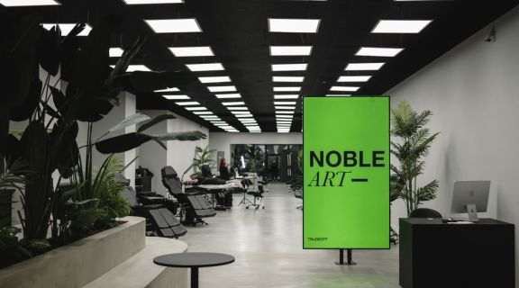

# 🔗 Tattoo Studio Frontend Project 🔗

Welcome to my Tattoo Studio frontend project using React in conjunction with a custom REST API made by me!



<br>
<br>

<summary> Table of contents 📝</summary> 
    <ol> 
    <li><a href="#about-the-project-📁">About the project</a></li> 
    <li><a href="#deploy-🚀">Deploy</a></li> 
    <li><a href="#stack">Stack</a></li> 
    <li><a href="#local-installation-option">Clone</a></li> 
    <li><a href="#features-⚒">Features</a></li> 
    <li><a href="#future-improvements">Future Improvements</a></li> 
    <li><a href="#contributions">Contribution</a></li> 
    <li><a href="#development">Development</a></li>    
    <li><a href="#appreciations">Appreciation</a></li> 
    <li><a href="#contact">Contact</a></li>
    </ol>

## About the project 📁

This Tattoo Studio frontend project is built using React to create a dynamic, user-engaging platform.
It connects with a REST API developed with TypeORM, TypeScript, Express, and Node.js to interact with tattoo studio data.
Features include booking appointments, managing user profiles, and browsing artist portfolios as well as admin view to manage t.

## Deploy 🚀

<div align="center">
 <a href="https://tattoo-studio-frontend.example.com/">
 <strong> Visit the live website here! </strong></a>🚀🚀🚀 </div>

## Stack

Technologies used for the project:

<div align="center"> 
<a href="https://reactjs.org/"> 
 
</a> 
<a href="https://www.typescriptlang.org/"> 

 </a>
 <a href="https://sass-lang.com/"> 
  
 </a> 
 <a href="https://axios-http.com/"> 
  
 </a> 
  <a href="https://axios-http.com/"> 
  
 </a> 
   <a href="https://axios-http.com/"> 
  
 </a> 
   <a href="https://axios-http.com/"> 
  
 </a> 
    <a href="https://axios-http.com/"> 
  
 </a>
     <a href="https://axios-http.com/"> 
  
 </a>
      <a href="https://axios-http.com/"> 
  
 </a>
       <a href="https://axios-http.com/"> 
  
 </a>
 </div>

## Local installation option ⚙️

1. Clone the repository from the URL:
   `git clone https://github.com/yourusername/tattoo-studio-frontend.git`
2. Go into the cloned repostiory
   ` cd tattoo-studio-front`
3. Install npm packages:
   `npm install `
4. Start the REST API server:
   `npm run dev`
   Open http://localhost:3000 to view the project in the browser.

- If you dont have SQL installed locally you can check the documentation of the REST API for a docker command to obtain it

5. Start the React project
   `npm run dev `
   Open http://localhost:517\* to view the project web page view in the browser.

## Features ⚒

#### User Authentication:

- Register new users.
- Login with email and password.

#### Appointments:

- Book new appointments.
- View and manage existing appointments.

#### Artist Portfolio:

- Browse tattoo artist portfolios.
- Select preferred artist for an appointment.

#### Interactive UI:

- Responsive design ensuring compatibility across various devices and screen sizes.
- Dashboard for Admins/Artists:
  Manage appointments, services, and user roles.

## Future Improvements 💡

✅ Implement user profile picture uploads.
⬜ Real-time notifications and reminders for upcoming appointments.
⬜ Enhanced filtering options for artist portfolios and bookings.
⬜ Integration of a payment gateway for advance bookings.

## Contribute to the project 📦

Feel free to suggest an improvment or functionality to my project.

There are two ways of doing this:

1. Opening an issue
2. Creating a fork of the repository
   - Creating a new branch
     ```
     $ git checkout -b feature/yourUsername -feat
     ```
   - Make a commit with your changes
     ```
     $ git commit -m 'feat: this X thing'
     ```
   - Make a push to the branch
     ```
     $ git push origin feature/yourUsername -feat
     ```
   - Opening a Pull Request

## Web refferences 📧

To achieve my project I used data from the following sites:

- google.com
- nobleart.com
- ink.com
- ...

## Development 📌

```js
const developer = "yoanastamenova";

console.log("Developed by: " + developer);
```

## Appreciation 📍

Forever gratefull to GeeksHubs Academy for the oportunety to learn and grow on my career path. ❤️

## Contact 📤

<a href = "mailto:yoana.stamenovaa@gmail.com"></a>
<a href="https://www.linkedin.com/in/yoanastamenova" target="_blank"></a>

</p>
